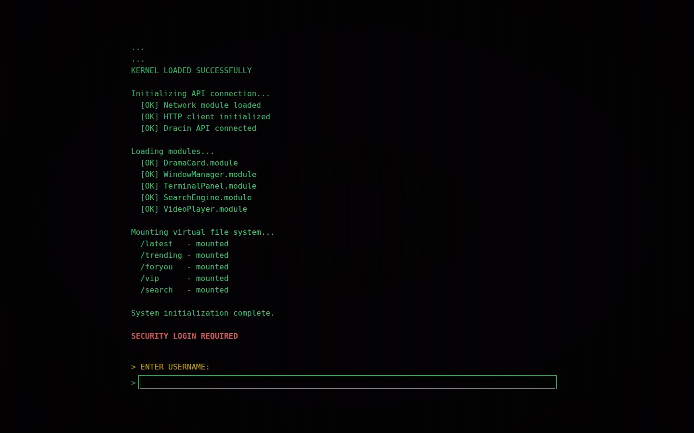
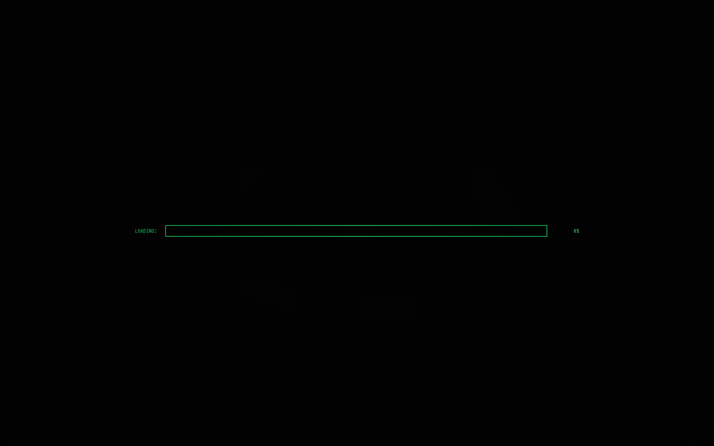
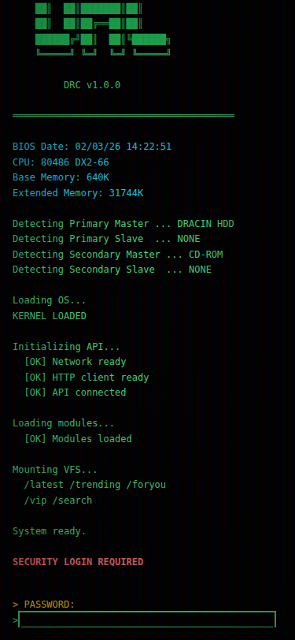
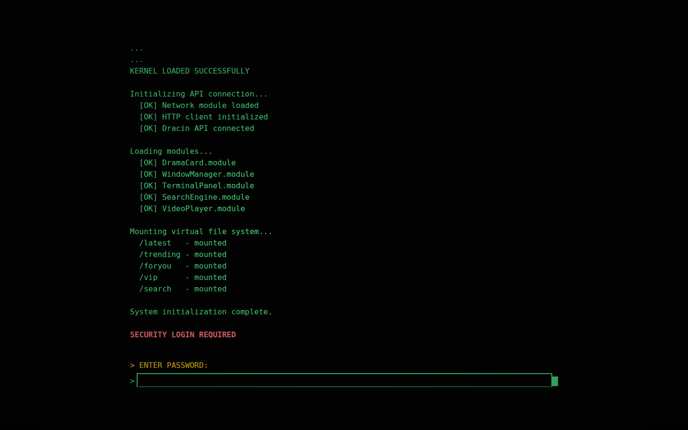

# 🎬 DRACIN

A retro-styled drama streaming web application with a unique terminal/desktop interface. Browse, search, and watch your favorite dramas with a nostalgic computing experience.


## 📸 Screenshots

### Desktop Interface

*Retro desktop environment with draggable windows*

### Video Player

*Built-in video player with auto-play next episode*

### Mobile Interface

*Responsive mobile design with touch-friendly controls*

### Terminal Commands

*Interactive terminal with various commands*

## ✨ Features

### 🖥️ Desktop Experience
- **Retro Desktop Interface** - Windows 95-inspired design with draggable windows
- **Multi-Window Support** - Open multiple drama windows simultaneously
- **Taskbar** - Classic taskbar with system status and clock

### 📱 Mobile Support
- **Responsive Design** - Fully optimized for mobile devices
- **Touch Controls** - Touch-friendly navigation and controls
- **Bottom Navigation** - Easy access to main sections

### 🎥 Video Playback
- **Encrypted Stream Decryption** - Automatic decryption via proxy API
- **Auto Next Episode** - Automatically play next episode when current ends
- **Quality Selection** - Multiple quality options (720p, 540p, etc.)
- **Fullscreen Support** - True fullscreen on all devices

### 📚 Watch History
- **Persistent History** - Track watched episodes locally
- **Resume Playback** - Continue from where you left off
- **Individual Removal** - Remove specific items with confirmation

### 💻 Terminal Commands
| Command | Description |
|---------|-------------|
| `help` | Show available commands |
| `clear` | Clear terminal history |
| `clearcache -s` | Clear server-side cache |
| `clearcache -l` | Clear local cache |
| `clearhist` | Clear watch history |
| `latest` | Open latest dramas |
| `trending` | Open trending dramas |
| `foryou` | Open recommendations |
| `vip` | Open VIP dramas |
| `status` | Show system status |
| `about` | Show version info |
| `logout` / `exit` | Clear session |

## 🛠️ Technical Stack

### Frontend
- **React 18** - UI library with hooks
- **TypeScript** - Type-safe development
- **Vite** - Fast build tool and dev server
- **Tailwind CSS** - Utility-first styling
- **Video.js** - HTML5 video player with HLS support
- **shadcn/ui** - Modern UI components

### Backend/Proxy
- **Node.js** - Runtime environment
- **Express** - Web framework
- **Axios** - HTTP client for API requests
- **cors** - Cross-origin resource sharing
- **dotenv** - Environment variable management

### Caching
- **IndexedDB** - Client-side caching via idb-keyval
- **NodeCache** - Server-side caching (3-hour TTL)

### API Integration
- **Primary API**: Sansekai Dramabox API
- **Backup API**: Failover API for reliability
- **Decryption Proxy**: Automatic stream decryption

## 📁 Project Structure

```
dracin/
├── app/                    # Frontend React application
│   ├── src/
│   │   ├── components/     # React components
│   │   │   ├── VideoPlayer.tsx    # Video player component
│   │   │   ├── DramaDetail.tsx    # Drama detail view
│   │   │   ├── DramaCard.tsx      # Drama card component
│   │   │   ├── TerminalPanel.tsx  # Terminal interface
│   │   │   └── ...
│   │   ├── services/       # API services
│   │   │   ├── dramaApi.ts        # Original API functions
│   │   │   └── dramaApiCached.ts  # Cached API with IndexedDB
│   │   ├── lib/            # Utilities
│   │   │   ├── cache/             # Caching system
│   │   │   └── history.ts         # Watch history management
│   │   ├── hooks/          # Custom React hooks
│   │   └── types/          # TypeScript definitions
│   └── ...
├── proxy/                  # Backend proxy server
│   └── server.js          # Express server with caching
├── .env.example           # Environment template
├── docker-compose.yml     # Docker setup
└── README.md             # This file
```

## 🚀 Getting Started

### Prerequisites
- Node.js 18+
- npm or yarn
- Git

### Installation

1. **Clone the repository**
   ```bash
   git clone https://github.com/energetictree/dracin.git
   cd dracin
   ```

2. **Setup environment variables**
   ```bash
   cp .env.example .env
   # Edit .env with your configuration
   ```

3. **Install dependencies**
   ```bash
   # Install proxy dependencies
   cd proxy && npm install
   
   # Install app dependencies
   cd ../app && npm install
   ```

4. **Start development servers**
   ```bash
   # Start proxy (from proxy/)
   npm run dev
   
   # Start frontend (from app/)
   cd ../app
   npm run dev
   ```

5. **Open in browser**
   - Frontend: http://localhost:5173
   - Proxy: http://localhost:3001

### Docker Deployment

```bash
# Build and start all services
docker-compose up -d

# View logs
docker-compose logs -f
```

## ⚙️ Configuration

### Environment Variables

| Variable | Description | Default |
|----------|-------------|---------|
| `DOMAIN` | Your domain | `localhost` |
| `PUBLIC_URL` | Public URL | `http://localhost:3002` |
| `PRIMARY_API_URL` | Main API endpoint | `https://api.sansekai.my.id/api/dramabox` |
| `BACKUP_API_URL` | Failover API | `https://apihub.bzbeez.work/api/dramabox` |
| `API_URL` | Current active API | Same as PRIMARY_API_URL |

## 🔒 Security Notes

- Never commit `.env` files containing real credentials
- API keys and sensitive URLs should be kept private
- The proxy server handles API authentication securely

## 🤝 Contributing

Contributions are welcome! Please feel free to submit a Pull Request.

## 📄 License

This project is licensed under the MIT License.

## 🙏 Credits

- **Powered by**: [Sansekai API](https://api.sansekai.my.id)
- **Author**: Eligible Enterprise
- **Build**: 2026.02.03

---

<p align="center">Made with 💚 for drama lovers</p>
